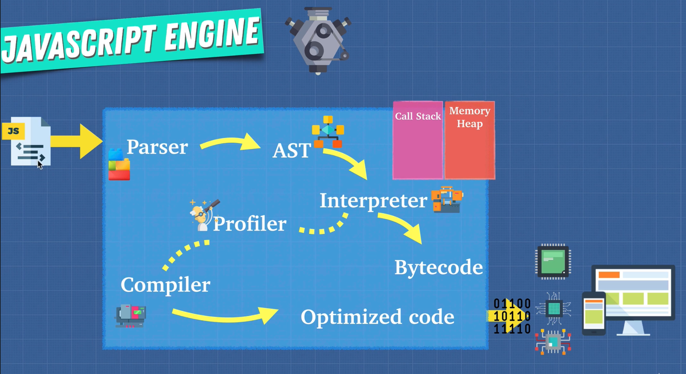

# The Advanced JavaScript

## Section 2: JavaScript Foundation

### JavaScript Engine

- JavaScript Engine が Js を理解する。
- たくさんの JavaScript Engine が存在する。Chrome には V8(C++で書かれている)が搭載されている。
- JS Engine が作った最初の人は、Brendan Eich って人。JS を作った人。

#### Interpretier

- 一行一行上から解釈していく。

#### Compiler



- 人間が理解できる言葉をコンピュータが理解できる言葉に翻訳するもの。
